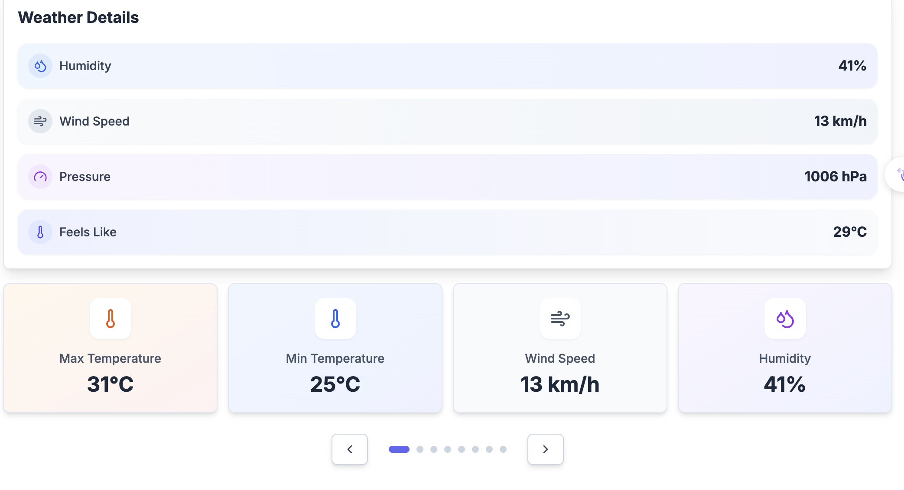
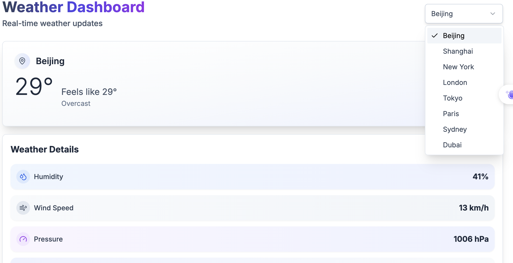

# Weather-Forecast

A modern weather forecast application based on Angular 17, providing real-time weather information and future weather forecast functionality.

## Features

- 🌤️ Real-time weather information display
- 📍 City search and location functionality
- 🌡️ Detailed information including temperature, humidity, wind speed, pressure
- 🌪️ Wind speed data
- 🌡️ Apparent temperature (feels like) and daily max/min temperatures
- 📱 Responsive design, mobile-friendly
- 🎨 Modern UI interface

## Tech Stack

- Angular 17
- TypeScript
- SCSS
- Angular Material (optional)
- **Open-Meteo API** (Free weather API, no API key required)

## 🌤️ Weather API - Open-Meteo

This project uses **Open-Meteo API**, a completely free weather API that requires no registration or API key.

### Why Open-Meteo?

- ✅ **Completely Free**: No registration, no API key required
- ✅ **No Rate Limits**: No strict calling frequency restrictions
- ✅ **High Quality Data**: Based on ECMWF (European Centre for Medium-Range Weather Forecasts)
- ✅ **Global Coverage**: Supports weather data for any location worldwide
- ✅ **Multiple Languages**: Supports Chinese and English city searches
- ✅ **Real-time Updates**: Data is updated regularly

### API Endpoints

#### 1. Weather Forecast
```
GET https://api.open-meteo.com/v1/forecast
```

**Parameters:**
- `latitude`: Latitude (required)
- `longitude`: Longitude (required)
- `current`: Current weather parameters
- `hourly`: Hourly forecast parameters
- `daily`: Daily forecast parameters
- `timezone`: Timezone (optional)
- `forecast_days`: Number of forecast days (1-16)

#### 2. Geocoding (City Search)
```
GET https://geocoding-api.open-meteo.com/v1/search
```

**Parameters:**
- `name`: City name (required)
- `count`: Number of results to return (optional)
- `language`: Language (zh/en)
- `format`: Response format (json)

### Usage Examples

#### Get Current Weather
```typescript
// Get current weather for Beijing
const url = 'https://api.open-meteo.com/v1/forecast?latitude=39.875&longitude=116.375&current=temperature_2m,relative_humidity_2m,apparent_temperature,weather_code,pressure_msl,wind_speed_10m&daily=weather_code,temperature_2m_max,temperature_2m_min,apparent_temperature_max,apparent_temperature_min&forecast_days=1&timezone=auto';
```

#### Search for Cities
```typescript
// Search for cities with "Beijing" in the name
const url = 'https://geocoding-api.open-meteo.com/v1/search?name=Beijing&count=1&language=en';
```

#### JavaScript Fetch Example
The typical weather application workflow involves **two main API calls**:

#### Step 1: City Search (Geocoding)
First, convert a city name to coordinates using the geocoding API:

```javascript
// Search for city coordinates
const geocodingUrl = `https://geocoding-api.open-meteo.com/v1/search?name=${cityName}&count=1&language=en`;
```

**Example Response:**
```json
{
  "results": [
    {
      "id": 1816670,
      "name": "Beijing",
      "latitude": 39.9042,
      "longitude": 116.4074,
      "elevation": 43.0,
      "feature_code": "PPLA",
      "country_code": "CN",
      "admin1_id": 1158811,
      "admin2_id": 1158825,
      "admin3_id": 1158826,
      "admin4_id": 1158827,
      "timezone": "Asia/Shanghai",
      "population": 21540000,
      "postcodes": ["100000"],
      "country_id": 1814991,
      "country": "China",
      "admin1": "Beijing",
      "admin2": "Beijing",
      "admin3": "Beijing",
      "admin4": "Beijing"
    }
  ],
  "generationtime_ms": 1.0
}
```

#### Step 2: Weather Data Retrieval
Then, use the coordinates to fetch weather data:

```javascript
// Get weather data using coordinates
const weatherUrl = `https://api.open-meteo.com/v1/forecast?latitude=${latitude}&longitude=${longitude}&current=temperature_2m,relative_humidity_2m,apparent_temperature,weather_code,pressure_msl,wind_speed_10m&daily=weather_code,temperature_2m_max,temperature_2m_min,apparent_temperature_max,apparent_temperature_min&forecast_days=1&timezone=auto`;
```

**Example Response:**
```json
{
  "latitude": 39.875,
  "longitude": 116.375,
  "generationtime_ms": 0.0749826431274414,
  "utc_offset_seconds": 28800,
  "timezone": "Asia/Shanghai",
  "timezone_abbreviation": "GMT+8",
  "elevation": 49,
  "current_units": {
    "time": "iso8601",
    "interval": "seconds",
    "temperature_2m": "°C",
    "relative_humidity_2m": "%",
    "apparent_temperature": "°C",
    "weather_code": "wmo code",
    "pressure_msl": "hPa",
    "wind_speed_10m": "km/h"
  },
  "current": {
    "time": "2025-06-26T17:00",
    "interval": 900,
    "temperature_2m": 30.5,
    "relative_humidity_2m": 39,
    "apparent_temperature": 30.7,
    "weather_code": 3,
    "pressure_msl": 1004.7,
    "wind_speed_10m": 10.7
  },
  "daily_units": {
    "time": "iso8601",
    "weather_code": "wmo code",
    "temperature_2m_max": "°C",
    "temperature_2m_min": "°C",
    "apparent_temperature_max": "°C",
    "apparent_temperature_min": "°C"
  },
  "daily": {
    "time": ["2025-06-26"],
    "weather_code": [3],
    "temperature_2m_max": [31.5],
    "temperature_2m_min": [24.7],
    "apparent_temperature_max": [33.2],
    "apparent_temperature_min": [26.1]
  }
}
```

### Data Field Explanations

#### Basic Information
- **latitude**: Latitude (39.875°N)
- **longitude**: Longitude (116.375°E) 
- **generationtime_ms**: API response generation time (0.074 seconds)
- **utc_offset_seconds**: UTC timezone offset (28800 seconds = +8 hours)
- **timezone**: Timezone name ("Asia/Shanghai")
- **timezone_abbreviation**: Timezone abbreviation ("GMT+8")
- **elevation**: Elevation above sea level (49 meters)

#### Current Weather (current)
- **time**: Current time ("2025-06-26T17:00")
- **interval**: Data update interval (900 seconds = 15 minutes)
- **temperature_2m**: Temperature at 2 meters height (30.5°C)
- **relative_humidity_2m**: Relative humidity at 2 meters height (39%)
- **apparent_temperature**: Apparent temperature/feels like (30.7°C)
- **weather_code**: Weather code (3 = Partly cloudy)
- **pressure_msl**: Mean sea level pressure (1004.7 hPa)
- **wind_speed_10m**: Wind speed at 10 meters (10.7 km/h)

#### Daily Temperature (daily)
- **weather_code**: Weather code (3 = Partly cloudy)
- **temperature_2m_max**: Daily maximum temperature (31.5°C)
- **temperature_2m_min**: Daily minimum temperature (24.7°C)
- **apparent_temperature_max**: Daily maximum apparent temperature (33.2°C)
- **apparent_temperature_min**: Daily minimum apparent temperature (26.1°C)

### How to Get API Response

#### Response Example

async function getWeatherData(latitude: number, longitude: number) {
  try {
    const response = await fetch(
      `https://api.open-meteo.com/v1/forecast?latitude=${latitude}&longitude=${longitude}&current=temperature_2m,relative_humidity_2m,apparent_temperature,weather_code,pressure_msl,wind_speed_10m&daily=weather_code,temperature_2m_max,temperature_2m_min,apparent_temperature_max,apparent_temperature_min&forecast_days=1&timezone=auto`
    );
    
    if (!response.ok) {
      throw new Error('Failed to fetch weather data');
    }
    
    const data = await response.json();
    console.log('Weather Data:', data);
    return data;
  } catch (error) {
    console.error('Error fetching weather data:', error);
    throw error;
  }
}

// Usage example
getWeatherData(39.875, 116.375);
```

### Get Weather Icons

Open-Meteo provides free weather icons based on weather codes:

```typescript
// Get weather icon URL
function getWeatherIcon(weatherCode: number, isDay: boolean = true): string {
  const time = isDay ? 'day' : 'night';
  return `https://open-meteo.com/images/weather/${time}/${weatherCode}.svg`;
}

// Usage example
const iconUrl = getWeatherIcon(3, true); // Day icon for partly cloudy
console.log('Weather Icon URL:', iconUrl);
```

### Weather Icons

Open-Meteo provides free weather icons:
```
https://open-meteo.com/images/weather/day/{weather_code}.svg
https://open-meteo.com/images/weather/night/{weather_code}.svg
```

### Weather Codes

Common weather codes:
- `0`: Clear sky
- `1-3`: Partly cloudy to overcast
- `45, 48`: Fog
- `51-55`: Drizzle
- `61-65`: Rain
- `71-75`: Snow
- `95`: Thunderstorm

### Supported Cities

Open-Meteo supports weather data for:
- All cities in China (Beijing, Shanghai, Guangzhou, Shenzhen, etc.)
- International major cities (New York, London, Tokyo, Paris, etc.)
- Any location worldwide using coordinates
- Fuzzy city name search

## Development Server

Run `ng serve` to start the development server. Navigate to `http://localhost:4200/`. The application will automatically reload if you change any of the source files.

## Code Generation

Run `ng generate component component-name` to generate a new component. You can also use `ng generate directive|pipe|service|class|guard|interface|enum|module`.

## Build

Run `ng build` to build the project. The build artifacts will be stored in the `dist/` directory.

## Running Unit Tests

Run `ng test` to execute the unit tests via [Karma](https://karma-runner.github.io).

## API Documentation

For more detailed information about Open-Meteo API:
- [Open-Meteo Official Website](https://open-meteo.com/)
- [API Documentation](https://open-meteo.com/en/docs)
- [GitHub Repository](https://github.com/open-meteo/open-meteo)

## Screenshots

### 7 Day Forecast & Weather Details





